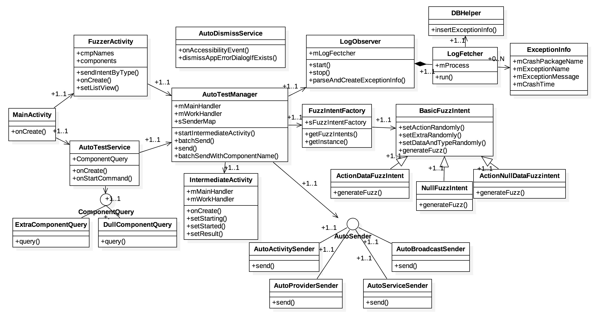
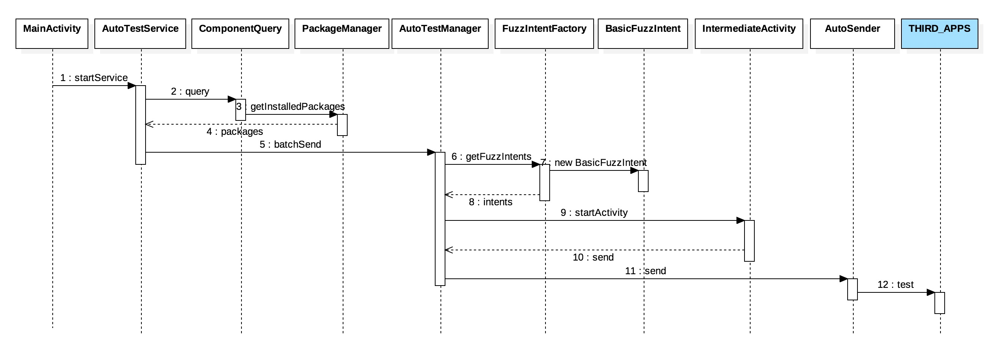
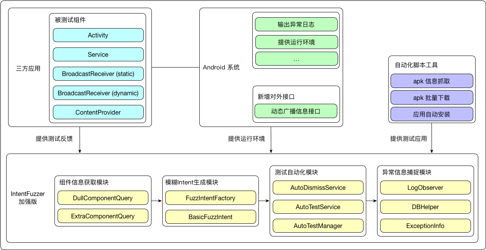

IntentFuzzer
====================

IntentFuzzer is inspired by the tool(https://www.isecpartners.com/tools/mobile-security/intent-fuzzer.aspx)
developed by iSECpartners(www.isecpartners.com).
You can specify an application,then either fuzz a single component or all components!
For a single component, just click an item listed. While click the "Null Fuzz All" button for all components!


扩展功能
===================

测试环境：Genymotion Custom Phone - 5.1.0 API 22 758x1280

要想让批量自动测试正常工作、并生成异常捕捉信息，需要做以下操作：

1. 如果是首次安装 APP，或者没有打开无障碍服务，需要在首页点击 "About" 进入设置界面给权限
2. 监听 EventLog 来获取异常信息需要应用为系统 APP, 依次输入命令
	* 卸载手机里已安装的 IntentFuzzer 应用
	* adb root (确保手机能够 root)
	* adb remount
	* adb shell (进入手机 shell)
	* cd /system/priv-app/
	* mkdir IntentFuzzer
	* exit
	* adb push <local apk file> /system/priv-app/IntentFuzzer/ (寻找到本地编译好的 apk 文件，一般能在项目目录中的bin 目录下找到)
	* adb reboot (重新启动手机，如果命令不生效，也可以手动重启)
	* 这个操作只做一次就行，之后在 eclipse 可以一键编译、安装 (AS 应该也行)

获取 DB 中的测试结果数据:

* PC 上下载一个 SQLite 客户端，我用的是：[http://sqlitebrowser.org/](http://sqlitebrowser.org/)
* adb pull /data/data/com.android.intentfuzzer/databases/result.db ./ (将测试结果 db 文件从手机拉到 PC)
* 使用 PC 上的客户端进行查看

## 简介

### 类图



* AutoDismissService: 在测试过程中，出现异常系统弹框会自动取消
* AutoTestManager: 测试管理者
* AutoTestService: 自动化测试所有应用组件服务
* ComponentQuery: 组件信息获取
* AutoSender: 组件Intent发送
* LogObserver: 监听系统中应用异常信息
* DBHelper: 用于异常数据持久化
* FuzzIntentFactory: 用于生成测试用的 fuzz intent

### 时序图



### 架构图



## 1. 组件信息收集

- [x] PMS.getInstalledPackages
- [] 支持动态Receiver获取

## 2. 模糊 Intent 生成

- [x] 完成共 7 种模糊 Intent 测试用例

## 3. 测试自动化

- [x] 批量测试组件
- [x] 自动开启、关闭 Activity，避免内存占用
- [x] 增加广播、服务组件的测试

## 4. 异常信息捕捉

- [x] 通过监听 EventLog 的方式，实现异常捕捉
- [x] 批量测试日志持久化到数据库中

## 5. 测试结果统计、可视化

## 实现原理

### Accessbility: 自动取消错误弹窗

涉及文件：

* /IntentFuzzer/src/com/android/intentfuzzer/auto/BaseAccessibilityService.java
* /IntentFuzzer/src/com/android/intentfuzzer/auto/AutoDismissService.java

核心代码:

```java
private void dismissAppErrorDialogIfExists(AccessibilityEvent event) {
	if (event.getEventType() == AccessibilityEvent.TYPE_WINDOW_CONTENT_CHANGED
			&& event.getPackageName().equals("android")) {
		AccessibilityNodeInfo nodeInfo = findViewByText("OK", true);
        if (nodeInfo != null) {
        	Utils.d(AutoDismissService.class, "dismiss AppErrorDialog");
            performViewClick(nodeInfo);
        }
	}
}
```

参考资料：

* [深入了解AccessibilityService](https://blog.csdn.net/dd864140130/article/details/51794318)
* [AccessibilityService分析与防御](https://lizhaoxuan.github.io/2017/11/29/AccessibilityService%E5%88%86%E6%9E%90%E4%B8%8E%E9%98%B2%E5%BE%A1/)

### EventLog: 自动捕捉错误日志 (需要手机root, 将应用提升为系统应用)

涉及文件：

* /IntentFuzzer/src/com/android/intentfuzzer/auto/LogObserver.java

核心代码：

```java
while (sStarted) {
	try {
		while ((line = dis.readLine()) != null) {
			ExceptionInfo exceptionInfo = parseAndCreateExceptionInfo(line);
			// IntentFuzzer 本身的异常不算入结果中
			if (exceptionInfo != null && !TextUtils.equals("com.android.intentfuzzer", 
					exceptionInfo.getmCrashPackageName())) {
				mDBHelper.insertExceptionInfo(exceptionInfo);
			}
		}
	} catch (Exception e) {
		e.printStackTrace();
		Utils.d(LogFetcher.class, "exception in reading log");
	}
}
```

参考资料:

* [Android event日志打印原理](https://blog.csdn.net/yaowei514473839/article/details/53513435)
* [Android-EventLog-Tags 说明](https://www.robotshell.com/2018/01/08/Android-EventLog-Tags-%E8%AF%B4%E6%98%8E/)

我们只使用到了 am_crash 的event log，用来获取应用崩溃信息, 示例：

am_crash(  519): [10992,0,com.svox.pico,8961605, java.lang.NullPointerException,Attempt to invoke virtual  method 'java.lang.String android.os.Bundle.getString(java.lang.String)' on a null object reference, GetSampleText.java,40]

### 模糊测试：

涉及文档都在该目录下：

* /IntentFuzzer/src/com/android/intentfuzzer/fuzz/BasicFuzzIntent.java
* /IntentFuzzer/src/com/android/intentfuzzer/fuzz/FuzzIntentFatory.java

核心代码：

```java
public List<BasicFuzzIntent> getFuzzIntents(ComponentName componentName) {
	List<BasicFuzzIntent> list = new ArrayList<BasicFuzzIntent>();
	
	// 内容为空的 Intent
	list.add(new NullFuzzIntent());
	
	// Action 与 Data 交叉，都不为空
	list.add(new ActionDataFuzzIntent());
	
	// Action 不为空, Data 为空
	list.add(new ActionNullDataFuzzIntent());
	// Action 不为空，Data 随机
	list.add(new ActionRandomDataFuzzIntent());
	
	// Action 为空，Data 不为空
	list.add(new NullActionDataFuzzIntent());
	// Action 随机，Data 不为空
	list.add(new RandomActionDataFuzzIntent());
	
	// 设置目标组件
	for (Intent intent : list) {
		intent.setComponent(componentName);
	}
	
	return list;
}
```

每次测试单个组件，都会进行以上intent的发送

## 应用preload功能

使用monkey进行实现

测试动态Receiver需要应用都被加载起来，以确保动态广播被注册到系统，这样才能获取到动态广播的信息

## 支持动态Receiver测试

因为动态Receiver是在各个应用运行状态下，可选择性的向AMS系统服务动态的注册与反注册，以实现监听与取消监听整个系统中的对应广播。与其它在Manifest.xml文件中注册的组件不同，动态注册的广播信息是不能通过PackageManager.getInstalledPackages进行获取的。基于此，很多测试工具并不支持动态广播的测试。

也有些研究结果虽然可以进行分析，但是却需要通过大量反编译第三方应用代码以获取动态广播类名信息，这种方法可以对技术水平不高的小众应用生效，然而这对于主流TOP应用基本是不可行的，因为主流APP多多少少会对应用做加固、混淆等保护措施，以避免因应用安全导致的损失。

因为AOSP其开源性，我们可以轻松获取到安卓系统的源码并进行修改与编译，对于模糊测试，我们可以从系统的角度下手，对测试APP暴露定制的数据接口，使得APP可以轻松、高效的获取到运行在系统中的动态Receiver信息

整个AOSP的修改patch可查看文件：0001-add-getDynamicReceiverNames-in-AMS-for-fuzz-intent-t.patch

### 实现(1) 修改IntentReceiver aidl文件


这里需要Binder的一些基础介绍，可以参考博客：

* [https://blog.csdn.net/fighting_sxw/article/details/78695658](https://blog.csdn.net/fighting_sxw/article/details/78695658)
* [https://blog.csdn.net/csdn_of_coder/article/details/53897110](https://blog.csdn.net/csdn_of_coder/article/details/53897110)

aidl 的基础，参考博客：

* [https://blog.csdn.net/hardworkingant/article/details/72804210](https://blog.csdn.net/hardworkingant/article/details/72804210)


代码修改：

```java
diff --git a/core/java/android/app/LoadedApk.java b/core/java/android/app/LoadedApk.java
index 5709c93..2ae58aa 100644
--- a/core/java/android/app/LoadedApk.java
+++ b/core/java/android/app/LoadedApk.java
@@ -1031,6 +1031,15 @@ public final class LoadedApk {
             }
 
             @Override
+            public String getReceiverName() {
+                LoadedApk.ReceiverDispatcher rd = mDispatcher.get();
+                if (rd != null) {
+                    return rd.mReceiver.getClass().getName();
+                }
+                return null;
+            }
+
+            @Override
             public void performReceive(Intent intent, int resultCode, String data,
                     Bundle extras, boolean ordered, boolean sticky, int sendingUser) {
                 final LoadedApk.ReceiverDispatcher rd;
                 
diff --git a/core/java/android/content/IIntentReceiver.aidl b/core/java/android/content/IIntentReceiver.aidl
index 3d92723..f3352d3 100644
--- a/core/java/android/content/IIntentReceiver.aidl
+++ b/core/java/android/content/IIntentReceiver.aidl
@@ -29,5 +29,6 @@ import android.os.Bundle;
 oneway interface IIntentReceiver {
     void performReceive(in Intent intent, int resultCode, String data,
             in Bundle extras, boolean ordered, boolean sticky, int sendingUser);
+    String getReceiverName();
 }
```

代码的修改的功能是在APP客户端的Binder Native中增加getReceiverName()接口，通过调用，客户端将返回动态Receiver的类名。获取到类名后，IntentFuzz测试动态广播时，就可以通过发送显示Intent以达到测试的目的。


### 实现(2)

在SystemServer AMS端暴露数据接口以供IntentFuzzer调用

```java
diff --git a/services/core/java/com/android/server/am/ActivityManagerService.java b/services/core/java/com/android/server/am/ActivityManagerService.java
index 53d4018..b278664 100644
--- a/services/core/java/com/android/server/am/ActivityManagerService.java
+++ b/services/core/java/com/android/server/am/ActivityManagerService.java
@@ -23003,6 +23003,18 @@ public final class ActivityManagerService extends ActivityManagerNative
         }
     }
 
+    @Override
+    public List<String> getDynamicReceiverNames() throws RemoteException {
+        List<String> receiverNames = new ArrayList<String>();
+        for (ReceiverList r : mRegisteredReceivers.values()) {
+            String receiverName = r.receiver.getReceiverName();
+            if (receiverName != null) {
+                receiverNames.add(receiverName);
+            }
+        }
+        return receiverNames;
+    }
+
-- 
```

上述代码的作用是遍历保存在ActivityManagerService中的，系统中所有的动态广播信息，依次binder call到APP客户端，依次来获取所有动态广播的类名

### 实现(3)

通过反射调用接口并获取动态广播信息

```java
diff --git a/core/java/android/app/ActivityManager.java b/core/java/android/app/ActivityManager.java
index d752e52..2343c98 100644
--- a/core/java/android/app/ActivityManager.java
+++ b/core/java/android/app/ActivityManager.java
@@ -3030,6 +3030,14 @@ public class ActivityManager {
         }
     }
 
+    public List<String> getDynamicReceiverNames() {
+        try {
+            return ActivityManagerNative.getDefault().getDynamicReceiverNames();
+        } catch (RemoteException e) {
+            throw e.rethrowFromSystemServer();
+        }
+    }
+
```

上述是ActivityManager的修改，因为不确认被测试系统是否拥有该方法，所以以反射的形式去调用该接口，当发现接口存在时才触发调用，否则的就不去获取动态广播的信息。这样做的好处是可以兼容各种版本的安卓系统。

/IntentFuzzer/src/com/android/intentfuzzer/componentquery/ExtraComponentQuery.java

```java
@Override
	public Map<Integer, List> query(int type) {
		Map<Integer, List> map = new HashMap<Integer, List>();
		
		Object object = ReflectUtils.reflect("android.app.ActivityMaanger")
				.method("getDynamicReceiverNames").get();
		
		if (object != null && object instanceof List) {
			List<String> list = (List<String>) object;
			map.put(AutoTestManager.SEND_TYPE_DYNAMIC_RECEIVER, list);
		} else {
			Utils.d(ExtraComponentQuery.class, "getDynamicReceiverNames failed!");
		}
		
		return map;
	}
```


## 数据来源

### 使用scrapy爬取、下载、安装TOP应用

APP来源: 小米商店 http://app.mi.com/

使用步骤：

1. brew install python3 // 安装python3
2. pip3 install Scrapy // 安装Scrapy
3. 下载项目
4. cd <项目目录>
5. scrapy crawl xiaomi // 启动爬虫并自动下载、安装应用

### 被测试应用信息

|序号|类型|个数|代表应用|
|---|---|---|---|
|1|聊天社交|17|QQ|
|2|影音视听|16|优酷|
|3|实用工具|13|拉勾|
|4|效率办公|12|有道云笔记|
|5|金融理财|9|支付宝|
|6|时尚购物|9|淘宝|
|7|医疗健康|8|美柚|
|8|新闻资讯|7|今日头条|
|9|体育运动|5|悦跑圈|
|10|学习教育|3|百词斩|

共100款应用

## 测试结果

100个应用分4批进行测试，每次测试25个应用。获取到有效应用组件信息情况:

|组件类别|个数|
|---|---|
|Activity|1186|
|Service|572|
|BroadcastReceiver(static)|298|
|BroadcastReceiver(dynamic)|89|
|ContentProvider|186|
|总结|2331|

`共发送测试模糊intent次数: 17334`

计算公式： (1186 + 572 + 298 + 89) * 6 + 186 * 4 * 6

（注：因为ContentProvider作为数据相关操作组件，共有增删查改共4个接口，所以需要*4）

`共出现异常次数: 837`


### 以异常类型为维度

|序号|异常类型|出现异常次数|
|---|---|---|
|1|java.lang.NullPointerException|482|
|2|java.lang.IllegalArgumentException|87|
|3|java.io.IOException|69|
|4|java.lang.IllegalStateException|41|
|5|java.lang.ClassCastException|36|
|6|java.lang.ArrayIndexOutOfBoundsException|25|
|7|java.lang.IndexOutOfBoundsException|19|
|8|android.content.ActivityNotFoundException|12|
|9|android.database.sqlite.SQLiteReadOnlyDatabaseException|9|
|10|java.lang.VerifyError|6|
|11|java.lang.NoSuchFieldError|5|
|12|android.database.sqlite.SQLiteCantOpenDatabaseException|3|
|13|java.lang.OutOfMemoryError|3|
|14|android.database.sqlite.SQLiteReadOnlyDatabaseException|3|
|15|其它|37|

(注：其它错误大多为 java.lang.UnsatisfiedLinkError 错误，为应用不兼容系统导致)


### 以应用为维度

|序号|应用包名|出现异常次数|
|---|---|---|
|1|com.v.study|51|
|2|com.picsart.studio|46|
|3|com.xueersi.parentsmeeting|43|
|4|com.jifen.qukan|32|
|5|com.cmplay.tiles2_cn.mi|28|
|...|...|...|
|96|com.tencent.mtt|2|
|97|com.changba|1|
|98|com.microsoft.office.word|1|
|99|com.tudou.android|1|
|100|com.tencent.wifimanager|0|

### 以组件异常为维度

|序号|组件类型|出现异常次数|
|---|---|---|
|1|Activity|513|
|2|Service|86|
|3|静态Receiver|67|
|4|动态Receiver|112|
|5|Provider|59|

### 对比其它测试应用 (功能维度)

|应用|Activity|Service|静态Receiver|动态Receiver|Provider|批量测试|多种模糊Intent|
|---|---|----|----|---|---|---|---|
|IntentFuzzer|√|√|√|×|×|×|×|
|IntentFuzzer加强|√|√|√|√|√|√|√|


License
===================
MIT License
